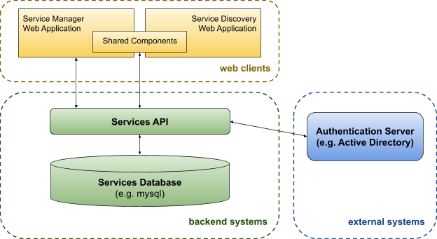
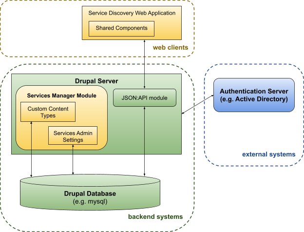

# Service Management & Calculator Portals

## Technical Design Document

_Authors: [toddgiles@google.com](mailto:toddgiles@google.com), [ibush@google.com](mailto:ibush@google.com), [mmoss@google.com](mailto:mmoss@google.com), [fwehle@google.com](mailto:fwehle@google.com) \
March 2020_

# Overview

This document describes the technical design of the Service Management Portal consisting of the following components:

- **_Service API_** - An API for Creating, Retrieving, Updating, and Deleting services backed by a database.
- **_Service Manager_** - A web based application for managing services meant for use by a civic entity (e.g. a city government).
- **_Service Calculator_** - A web based application for finding and discovering available services for use by the general public (e.g. residents in a city).

The term **_Service_** as used in this document refers to services provided to individuals in the “real world” as opposed to one of the other myriad definitions a service could take in a technical context (e.g. a child care subsidy program offered by a City Government for low-income residents would be a **_Service_**).

## System Diagram



# Design

## Web Clients

There are two web clients, one for service management (internal facing), the other for the service calculator (public facing). These web applications are written in javascript, html, and css using the [React JS libraries](https://reactjs.org/).

### Service Manager

The service manager is the content management system for the service data. It consists of the following pages:

- Service listing - listing of all services divided into drafts, published, and archived services.
- Service / draft viewing - read-only “preview” of a service
- Service / draft editing - edit view of a service
- Settings - admin only settings pages, including department and interest lists, user activity, and service editing activity

Routing to these pages are handled by the routes defined in [/client/service-manager/src/routes/](/client/service-manager/src/routes) and the rendering of these pages are handled by the components defined in [/client/service-manager/src/components/](/client/service-manager/src/components).

#### Analytics

The service manager sends [pageviews](https://support.google.com/analytics/answer/6086080?hl=en) and the following [events](https://support.google.com/analytics/answer/1033068?hl=en) to Google Analytics tracking usage of the Service Manager:

<table>
  <tr>
   <td><strong>Category</strong>
   </td>
   <td><strong>Action</strong>
   </td>
   <td><strong>Label</strong>
   </td>
   <td><strong>Value</strong>
   </td>
  </tr>
  <tr>
   <td>Action
   </td>
   <td>Cancel
<p>
Continue
<p>
Leave This Page
<p>
Login
<p>
No, Cancel
<p>
Share
<p>
Stay on This Page
<p>
Yes, Archive
<p>
Yes, Delete
<p>
Yes, Publish
   </td>
   <td>Login, Share
<p>
Draft Already Exists
<p>
Navigate Away Before Saving?
<p>
Login
<p>
Archive, Delete, Publish
<p>
Share
<p>
Navigate Away Before Saving?
<p>
Archive
<p>
Delete
<p>
Publish
   </td>
   <td>N/A
   </td>
  </tr>
  <tr>
   <td>Auth
   </td>
   <td>Login
<p>
Logout
   </td>
   <td>Success, Failure
<p>
Success
   </td>
   <td>N/A
   </td>
  </tr>
  <tr>
   <td>Click
   </td>
   <td>Analytics
   </td>
   <td>The analytics link clicked
   </td>
   <td>N/A
   </td>
  </tr>
</table>

### Service Calculator

The service calculator client is the public facing tool used for finding services of interest. It consists of the following pages:

- Service listing - lists all services, and provides search and filtering capabilities to find the service you are looking for
- Service details - a detailed view of a single service

Routing to these pages are handled by the routes defined in [/client/service-calculator/src/routes/](/client/service-calculator/src/routes) and the rendering of these pages are handled by the components defined in [/client/service-calculator/src/components/](/client/service-calculator/src/components).

#### Analytics

The service calculator client sends [pageviews](https://support.google.com/analytics/answer/6086080?hl=en) and the following [events](https://support.google.com/analytics/answer/1033068?hl=en) to Google Analytics tracking usage of Service Calculator:

<table>
  <tr>
   <td><strong>Category</strong>
   </td>
   <td><strong>Action</strong>
   </td>
   <td><strong>Label</strong>
   </td>
   <td><strong>Value</strong>
   </td>
  </tr>
  <tr>
   <td>Api
   </td>
   <td>Fetch
   </td>
   <td>Interests, Services, Settings
   </td>
   <td>N/A
   </td>
  </tr>
  <tr>
   <td>Click
   </td>
   <td>Language
<p>
Interests
<p>
People
<p>
Income
<p>
Address
<p>
Clear
<p>
Share
<p>
ApplyOnline
<p>
Call
<p>
CityWebsite
<p>
EmbeddedLink
<p>
Feedback
<p>
LearnMore
<p>
LearnMore_Apply
<p>
MapAddress
<p>
SendEmail
<p>
Share
   </td>
   <td>En Español, In English
<p>
Add Interests
<p>
Add People
<p>
Add Income
<p>
Add Address
<p>
Clear Selections
<p>
Shared by Email, Cancelled
<p>
{url clicked}
<p>
{phone number clicked}
<p>
{url clicked}
<p>
{url clicked}
<p>
{url clicked}
<p>
{url clicked}
<p>
{url clicked}
<p>
{url clicked}
<p>
{email address clicked}
<p>
Shared by Email
   </td>
   <td>N/A
   </td>
  </tr>
  <tr>
   <td>Filter
   </td>
   <td>AllInterests
<p>
Income
<p>
Interests
<p>
People
<p>
People
<p>
Resident
   </td>
   <td>{list of interests selected}
<p>
N/A
<p>
{individual interest selected}
<p>
Adults, Children, OlderAdults
<p>
HouseholdSize
<p>
True, False
   </td>
   <td># interests
<p>
$ amount
<p>
N/A
<p>
# people
<p>
total # people
<p>
N/A
   </td>
  </tr>
</table>

### Shared Components

A large number of the service display components are shared between the two clients. These shared components are located in [/client/common/](/client/common) and include the service display components, as well as other miscellaneous shared client code (e.g. data access code that fetches data from the backend APIs).

#### Frontend Translations

All the text in the Service Calculator (and some in the Service Manager) is located in language specific resource files in [/client/common/locales/](/client/common/locales). These files could/should be overwritten for your needs by including a modified copy in your deploy directory (see [/sample-deploy-env/locales/](/sample-deploy-env/locales) for an example).

## Backend Systems

The backend consists primarily of a [CRUD](https://en.wikipedia.org/wiki/Create,_read,_update_and_delete) api for the services themselves, as well as ancillary data (i.e. departments, interests, settings, and user activity). The data itself is stored in a [mysql](https://www.mysql.com/) database (or equivalent alternative, e.g. [MariaDB](https://mariadb.org/)).

### Services API

The Services API is written in [PHP](https://www.php.net/) and using [API Platform](https://api-platform.com/) which itself is built upon the [Symfony](https://symfony.com/) PHP framework. An alternative backend implementation has also been created in [Drupal](#drupal).

#### Configuration

Configuration of the API is managed using environment variables. The default environment (suitable for development) is configured in the [/api/.env](/api/.env) configuration file. This configuration should be overridden by adding an .env.local file in your deployment environment, overriding settings for your environment. Each configuration environment variable is documented in the .env file directly.

Symfony itself is highly configurable with it’s configuration defined in the [/api/config/](/api/config) directory. Details on the configuration files found here are out of scope of this document, but are documented extensively for each package used. See also [Configuring Symfony](https://symfony.com/doc/current/configuration.html).

#### Services

##### Service

The /api/services endpoint handles CRUD operations for the services themselves. Each service is identified by a uuid upon creation and can be updated, retrieved and deleted using that uuid. **NOTE:** deletion is implemented as a “soft delete” and continues to show up as an “archived” service in the service management client.

##### ServiceAnalytics

A subset of google analytics for a specific service can be retrieved from this endpoint. The backend retrieves analytics via the [Analytics Reporting API](https://developers.google.com/analytics/devguides/reporting/core/v4) using a service account specified in the GOOGLE_API_CONFIG env variable. The view that the analytics is pulled from can be specified via the ANALYTICS_VIEW_ID env variable.

##### ServiceActivity

The backend maintains some aggregate statistics on the edits, publishes, and archival of services. These statistics can be retrieved from the service activities endpoint.

##### ServiceEligibility

Each service has associated eligibility rules associated with it. This endpoint allows CRUD operations for a service’s eligibility rules. Note however that eligibility rules can also be retrieved and modified directly from the services endpoint, so the current web applications never make requests to this endpoint directly.

##### ServiceHistory

Whenever a service is published, a copy of the service is also stored as a new version in the history table. These historical services can be retrieved from the service history endpoints, but can also be retrieved with the associated service from the services endpoint.

##### ServiceShare

A service can be shared with individuals who are then given edit access to that service. This is done through the service share endpoint.

##### ServiceDraft

A service is stored as a “draft” prior to being published. Draft services are managed through the service draft endpoint. In addition to standard CRUD operation endpoints, there is an /api/service_drafts/{id}/publish endpoint that handles publishing a draft (implemented in [/api/src/Controller/PublishServiceController.php](/api/src/Controller/PublishServiceController.php) and [/api/src/Handler/PublishServiceHandler.php](/api/src/Handler/PublishServiceHandler.php)).

#### Departments / Interests

Departments and interests each have a separate endpoint for CRUD operations for these entities.

#### UserActivity

Data about users managing services are available from the user activity endpoint. This includes the number of logins, number of edits, and the number of services archived by each user.

#### Settings

The settings api exposes a CRUD endpoint for storing name/value pairs of settings data for the application. For example, the federal poverty level income amounts for various household sizes are managed as a setting.

#### Translations

Language translations for services, departments, and interests may be created through a PUT to the associated entity endpoint, with the “locale” query parameter set to the two-letter language code. Entity translations can be retrieved through a GET to the associated endpoint, with the “locale” query parameter or “accept-language” header set to the desired language code. For example, a Spanish translation for a service may be added/retrieved with a PUT/GET to /api/services/{id}?locale=es. By default, if there is no translation in the requested locale for an entity field, the English translation of that field is returned. To receive an empty value instead, set the GET request query parameter “noTranslationFallback” to “true”. These translation query parameters are handled in [/api/src/EventSubscribers/LocaleSubscriber.php](/api/src/EventSubscribers/LocaleSubscriber.php).

See also [Frontend Translations](#frontend-translations).

### Services Database

All of the service data, and associated metadata exposed in the [Services API](#services-api) is stored in a mysql (or compatible) database. This database and it’s schema are managed using the [Doctrine ORM](https://symfony.com/doc/current/doctrine.html).

Most database entities are created based off of the php objects defined in [/api/src/Entity/](/api/src/Entity). The exception to this is translations, which are stored using the [Doctrine Translatable Extension](https://github.com/Atlantic18/DoctrineExtensions/blob/v2.4.x/doc/translatable.md) in a database table ext_translations. An entity’s translatable fields are marked with @Gedmo\Translatable.

## External Systems

### Authentication Server

Authentication on the backend is provided using the [Symfony Security Component](https://symfony.com/doc/current/components/security/authentication.html). This component supports multiple authentication paradigms. The default configuration as implemented is setup to authenticate against an [LDAP server](https://symfony.com/doc/current/security/ldap.html) (e.g. OpenLDAP or Active Directory). See also [API Authentication](../api/README.md#authentication) for more information.

## Drupal

The alternative Drupal backend replaces the Backend Systems and the Service Manager frontend, described above, with a custom "Services Manager" Drupal module, allowing integration with existing Drupal systems and providing a more "native" Drupal feel by leveraging Drupal's built-in content management and workflow functionality. The Service Calculator frontend is unchanged, other than a couple .env variables to tell it to talk to the Drupal API instead of the standalone Services API. The modified system diagram looks like the following:



#### Migration

The Services Manager Module also provides several migration configurations, built on Drupal's [Migrate API](https://www.drupal.org/docs/8/api/migrate-api/migrate-api-overview), to automatically import service data from the standalone backend into the corresponding Drupal content types. See the Migration section of the [Drupal README](../drupal/README.md#Migration).

# Metrics

Google analytics is the primary source of metrics for usage of the applications. See [Service Manager > Analytics](#analytics) and [Service Calculator > Analytics](#analytics-1) for more details on analytics stored.

## Success metrics

Success metrics for both the Service Manager and Service Calculator portals were identified and grouped into five categories:

- **Awareness** – Do users know this portal exists? (e.g., qualitative user surveys)
- **Utilization** – Are users using the portal? (e.g., portal abandonment rate, frequency of service content updates, portal usage periods)
- **User Sentiment** – Is the portal helpful for users? (e.g. rate of users sharing)
- **Usability** – Do users enjoy using the portal? (e.g., perceived ease of use)
- **Target** – Is the portal leading to desired outcomes? (e.g., increase in service applications and approvals [particularly for under-utilized services], increased awareness of city services)

# Security

The web applications are built on top of actively maintained frameworks, and use
their built-in security features. However, all dependencies should be [properly maintained](code_maintenance.md) to ensure security patches are promptly applied
when available.

- React:
  - [React Vulnerabilities](https://snyk.io/node-js/react)
  - [Auditing packaged dependencies for security vulnerabilities](https://docs.npmjs.com/auditing-package-dependencies-for-security-vulnerabilities)
- API Platform:
  - [API Platform Security](https://api-platform.com/docs/core/security/) is used to require properly authenticated users to retrieve sensitive data (e.g. edit history).
- Symfony:
  - [Symfony Security Monitoring](https://security.symfony.com/) can be used to monitor PHP security vulnerabilities.
  - API Platform Security is implemented on top of [Symfony Security](https://symfony.com/doc/current/security.html), for which we also use [ldaptools](https://github.com/ldaptools/ldaptools) to authenticate users against OpenLDAP and/or Active Directory servers.
  - [NelmioCorsBundle](https://github.com/nelmio/NelmioCorsBundle) is used to handle CORS preflight OPTIONS requests and to add CORS headers on all server responses.

See documentation on [code maintenance](code_maintenance.md) for more details on all the project dependencies.

## Secure Service Management

The service management client is the only client that attempts to mutate data. It also requires login credentials in order to mutate data. A simple way to add an extra layer of security would be to only allow access to login and the service management client for users within the City’s internal network. Using apache, for example this can be done by adding the following directives (replacing the paths and ip addresses for your local install):

```
<Directory "\path\to\deploy\public\manager">
   Require ip 10.1.0.0/16
</Directory>

<Location "/api/login">
   Require ip 10.1.0.0/16
</Location>
```

See [Directory](https://httpd.apache.org/docs/2.4/mod/core.html#directory), [Location](https://httpd.apache.org/docs/2.4/mod/core.html#location), and [Require](https://httpd.apache.org/docs/2.4/mod/mod_authz_core.html#require) documentation for apache.

# Privacy

The only data stored by the Service Calculator is server logs (e.g. apache logs and php error logs). Google Analytics data is also sent as described above. Absolutely no user specific data is stored in the underlying database of the Service Calculator - in fact the calculator only retrieves data from the database and then effectively displays the service data to end users w/out any further requests sent to the server backends (outside of Google Analytics).

The Service Manager however does record more detailed information around end-users creating, updating, publishing, and archiving services. In particular a history of all published services is maintained indefinitely, including the user(s) who edited the service and when that edit took place. Login details including the number of logins and last login of service manager users is also recorded. This data is useful for Service Manager admins to use as they manage the services and web applications within the City.

# Testing

## Services API

Tests for the services API can be found in [/api/tests/](/api/tests). These tests are written using the [PHPUnit testing framework](https://phpunit.de/) with [API Platform testing utilities](https://api-platform.com/docs/core/testing/). Test data is created using the [Alice fixtures generator](https://github.com/nelmio/alice) and defined in [/api/fixtures/](/api/fixtures).

## Web Clients

Tests for Service Manager and Service Calculator components can be found alongside the tested components. These tests use the [Jest](https://jestjs.io/) testing framework integrated with [Create React App](https://create-react-app.dev/) (see the [testing section](https://create-react-app.dev/docs/running-tests/)). Frontend test data is generated from the backend Alice fixtures data with [`npm run update-mocks`](/client/service-manager#npm-run-update-mocks) and can be found in [/client/testing/](/client/testing).
